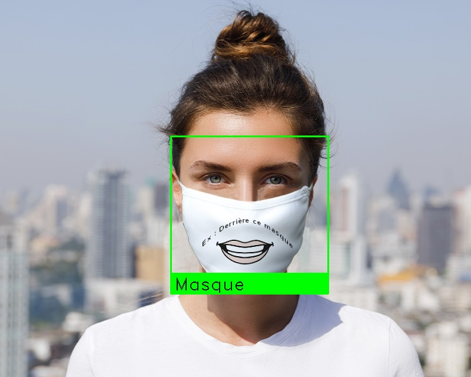
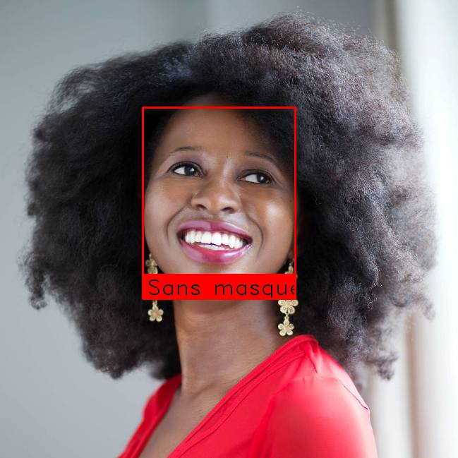
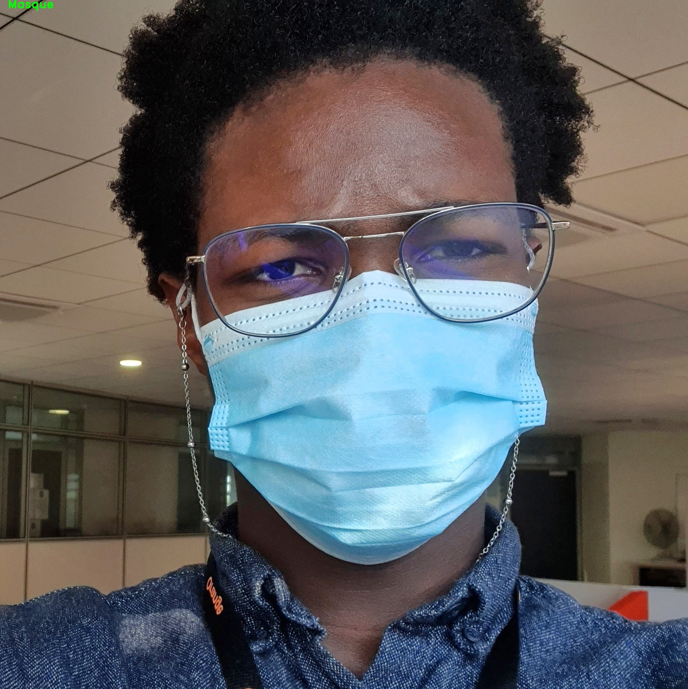

# Mask Detector
This application is a mask detector in an image. In a COVID-19 context where wearing a mask is highly recommended. This demonstrates the application of deep learning to detect masks in an image.

## How it works
This application was built in two steps: 
1. Presence of a mask in the image: Yes or No ?
2. Detect the mask in the image.

In the first step, a classification model must be built to find out whether or not an image contains a mask. See the code [here](https://gitlab.com/schalappe/spot-the-mask-challenge)

With a model to tell if an image contains a mask. We can build an application to detect masks on people's faces. This application functions in 3 phases:
1. use an algorithm to detect faces
2. extract the detected faces
3. determine if the image (face) contains a mask

For face detection, [MTCNN](https://github.com/ipazc/mtcnn) package is used. This can cause some problems. Because the success of the application depends on the correct performance of this package.

## Example

## Go further
The use of the face detection application can lead to errors. If the face is not recognized, there is no mask detection. To go further, we can specially train a model to detect masks.

